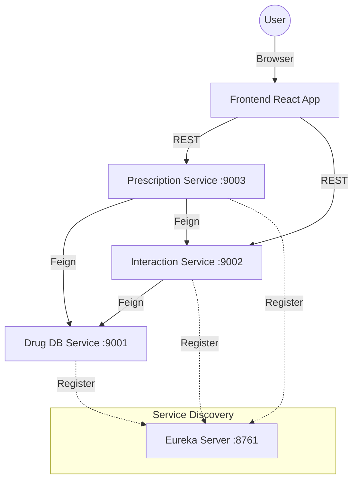

# MediGuard - Drug Interaction System

MediGuard is a comprehensive microservices-based application designed to prevent adverse drug interactions. It aids healthcare professionals by analyzing prescriptions for potential conflicts, ensuring patient safety through real-time checks and validations.

## 🏗️ Architecture

The system is built using a **Microservices Architecture** powered by **Spring Boot** and **Spring Cloud**. It utilizes **Eureka** for service discovery and **OpenFeign** for inter-service communication.

### System Overview


## 🚀 Microservices

| Service | Port | Description |
|---------|------|-------------|
| **Eureka Server** | `8761` | Service Registry & Discovery server. |
| **Drug Database** | `9001` | Manages the master repository of drug data (names, dosages, side effects). |
| **Interaction** | `9002` | Analyzes drug pairs for conflicts and calculates risk scores. |
| **Prescription** | `9003` | Handles prescription creation, validation, and storage. |
| **Frontend** | `8080` | React/Vite-based user interface for doctors and patients. |

## 🛠️ Prerequisites

Before running the application, ensure you have the following installed:
- **Java JDK 17+**
- **Apache Maven**
- **Node.js (v18+) & npm**
- **Docker & Kubernetes** (Optional, for containerized deployment)

## 📦 Installation & Running Locally

### 1. Start the Backend Services
Services must be started in the following order:

**Terminal 1: Eureka Server**
```bash
cd eureka-server
mvn spring-boot:run
```
*Wait for this to start completely before proceeding.*

**Terminal 2: Drug Database Service**
```bash
cd drug-database-service
mvn spring-boot:run
```

**Terminal 3: Interaction Service**
```bash
cd interaction-service
mvn spring-boot:run
```

**Terminal 4: Prescription Service**
```bash
cd prescription-service
mvn spring-boot:run
```

### 2. Start the Frontend
**Terminal 5: React App**
```bash
cd medicare-connect-main
npm install
npm run dev
```
Access the application at: `http://localhost:8080`

## ☁️ Deployment (Kubernetes)

The project includes K8s configurations in the `k8s/` directory.

1. **Start Minikube/Cluster**: `minikube start`
2. **Apply Configurations**:
   ```bash
   kubectl apply -f k8s/
   ```
3. **Verify Pods**: `kubectl get pods`

## 🔌 API Interaction

### Interaction Analysis
- **Endpoint**: `GET http://localhost:9002/interactions/analyze`
- **Params**: `drugA` (ID), `drugB` (ID)
- **Response**: Risk level and severity score.

### Create Prescription
- **Endpoint**: `POST http://localhost:9003/prescriptions`
- **Body**:
  ```json
  {
    "patientName": "John Doe",
    "items": [
      { "drugId": 1, "doseMg": 500 },
      { "drugId": 2, "doseMg": 400 }
    ]
  }
  ```

## 📄 Documentation
For more detailed information, please refer to the internal guides:
- [Run Guide](RUN_GUIDE.md)
- [Microservices Interaction](MICROSERVICES_INTERACTION.md)
